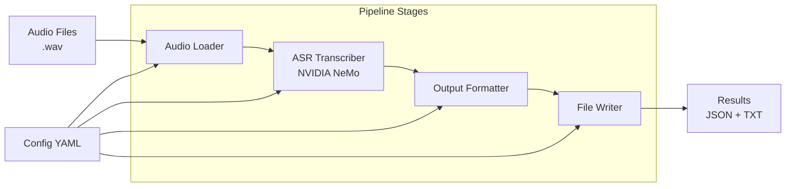

# 🏗️ Core ASR Transcription Pipeline - Implementation Plan

## 📐 Architecture Overview



## 🧩 Core Components

| Component | Purpose | Key Features |
|-----------|---------|--------------|
| **Audio Loader** | Load and prepare `.wav` files | Resampling, validation, batching |
| **ASR Transcriber** | Speech-to-text conversion | NVIDIA NeMo integration, GPU optimization |
| **Output Formatter** | Structure transcription results | Timestamps, confidence scores, metadata |
| **File Writer** | Save processed results | JSON/TXT output, directory creation |
| **Config Manager** | Handle YAML configurations | OmegaConf integration, validation |
| **Main Pipeline** | Orchestrate processing stages | Error handling, logging, caching |

## 📁 Project Structure

```
audio_aigented/
├── src/
│   └── audio_aigented/
│       ├── __init__.py
│       ├── audio/
│       │   ├── __init__.py
│       │   └── loader.py          # Audio file loading & preprocessing
│       ├── transcription/
│       │   ├── __init__.py
│       │   └── asr.py             # NVIDIA NeMo ASR integration
│       ├── formatting/
│       │   ├── __init__.py
│       │   └── formatter.py       # Output structuring
│       ├── output/
│       │   ├── __init__.py
│       │   └── writer.py          # File writing (JSON/TXT)
│       ├── config/
│       │   ├── __init__.py
│       │   └── manager.py         # Configuration management
│       ├── models/
│       │   ├── __init__.py
│       │   └── schemas.py         # Pydantic data models
│       └── pipeline.py            # Main pipeline orchestration
├── tests/
│   ├── __init__.py
│   ├── test_audio/
│   ├── test_transcription/
│   ├── test_formatting/
│   ├── test_output/
│   └── test_pipeline.py
├── config/
│   └── default.yaml               # Default configuration
├── examples/
│   ├── sample_audio/
│   └── basic_usage.py
├── inputs/                        # Default input directory for .wav files
├── outputs/                       # Default output directory structure
│   └── [audio_filename]/          # Per-file output directories
│       ├── transcript.json        # Structured transcription data
│       └── transcript.txt         # Human-readable transcript
├── cache/                         # ASR model and processing cache
├── main.py                        # CLI entry point
├── pyproject.toml                 # Dependencies & project config
└── README.md                      # Documentation
```

## 📂 Directory Management Strategy

### Input Directory Structure
- **Default Location**: `./inputs/`
- **File Pattern**: `*.wav` files in the input directory
- **Validation**: Check file existence, format, and audio properties
- **Scanning**: Recursive scanning with configurable depth

### Output Directory Structure
- **Default Location**: `./outputs/`
- **Per-File Directories**: Each audio file gets its own subdirectory
- **Naming Convention**: `[audio_filename_without_extension]/`
- **Contents**:
  - `transcript.json` - Structured transcription with timestamps, confidence scores
  - `transcript.txt` - Human-readable transcript format

### Example Directory Layout
```
inputs/
├── meeting_recording.wav
├── interview_audio.wav
└── conference_call.wav

outputs/
├── meeting_recording/
│   ├── transcript.json
│   └── transcript.txt
├── interview_audio/
│   ├── transcript.json
│   └── transcript.txt
└── conference_call/
    ├── transcript.json
    └── transcript.txt
```

## � Implementation Steps

### Phase 1: Project Foundation
1. **Dependencies Setup** - Add NVIDIA NeMo, PyTorch, librosa, pydantic, omegaconf
2. **Data Models** - Create Pydantic schemas for transcription results
3. **Configuration System** - YAML-based config with OmegaConf
4. **Basic Project Structure** - Create module directories and `__init__.py` files

### Phase 2: Core Components
5. **Audio Loader** - `.wav` file loading, validation, resampling for NeMo compatibility
6. **ASR Transcriber** - NVIDIA NeMo integration with GPU optimization
7. **Output Formatter** - Structure results with timestamps and confidence scores
8. **File Writer** - Save JSON/TXT outputs with proper directory structure

### Phase 3: Pipeline Integration
9. **Main Pipeline** - Orchestrate all stages with error handling
10. **CLI Interface** - Command-line interface through `main.py`
11. **Caching System** - Cache ASR results to avoid re-processing
12. **Logging & Monitoring** - Comprehensive logging for debugging

### Phase 4: Testing & Documentation
13. **Unit Tests** - Pytest tests for each component (minimum 3 tests per module)
14. **Integration Tests** - End-to-end pipeline testing
15. **Documentation** - Update README with usage examples
16. **Example Scripts** - Demonstration scripts with sample audio

## ⚙️ Key Technical Details

### NVIDIA NeMo Integration
- Use pre-trained conformer models (e.g., `stt_en_conformer_ctc_large`)
- GPU acceleration with CUDA 12.8
- Batch processing for efficiency
- Automatic model caching

### Configuration Schema
```yaml
audio:
  sample_rate: 16000
  batch_size: 8
  
transcription:
  model_name: "stt_en_conformer_ctc_large"
  device: "cuda"
  enable_confidence_scores: true
  
output:
  format: ["json", "txt"]
  include_timestamps: true
  output_dir: "./outputs"
  
processing:
  enable_caching: true
  cache_dir: "./cache"
```

### Data Models
- `TranscriptionResult` - Complete transcription with metadata
- `AudioSegment` - Individual audio segments with timestamps
- `ProcessingConfig` - Configuration validation schema

## 🎯 Success Criteria
- Successfully transcribe `.wav` files using NVIDIA NeMo
- Generate structured JSON and readable TXT outputs
- GPU-optimized processing with caching
- Comprehensive test coverage (>90%)
- Clear documentation and usage examples
- Modular, maintainable codebase (<500 lines per file)

## 🚀 Next Steps
Ready to switch to **Code Mode** for implementation starting with Phase 1: Project Foundation.