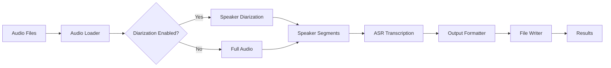

# Pipeline Overview

The Audio Transcription Pipeline is designed as a modular, extensible system for converting speech to text with speaker attribution.

## Architecture

The pipeline follows a sequential processing model with five main stages:



## Processing Flow

### 1. Audio Loading
- **Purpose**: Load and prepare audio files for processing
- **Module**: `audio_aigented.audio.loader`
- **Functionality**:
  - Validates WAV file format
  - Resamples to target rate (16kHz)
  - Converts to mono if needed
  - Extracts audio metadata

### 2. Speaker Diarization (Optional)
- **Purpose**: Identify different speakers and their speaking segments
- **Module**: `audio_aigented.diarization.diarizer`
- **Functionality**:
  - Detects voice activity
  - Extracts speaker embeddings
  - Clusters speakers
  - Outputs RTTM format segments

### 3. ASR Transcription
- **Purpose**: Convert speech segments to text
- **Module**: `audio_aigented.transcription.asr`
- **Functionality**:
  - Processes audio segments
  - Uses NVIDIA NeMo models
  - Generates confidence scores
  - Preserves timing information

### 4. Output Formatting
- **Purpose**: Structure transcription data for different use cases
- **Module**: `audio_aigented.formatting.formatter`
- **Functionality**:
  - Aligns transcriptions with speakers
  - Formats multiple output types
  - Calculates statistics

### 5. File Writing
- **Purpose**: Save results to disk
- **Module**: `audio_aigented.output.writer`
- **Functionality**:
  - Creates output directories
  - Writes JSON, TXT, and attributed formats
  - Generates processing summaries

## Key Components

### Pipeline Orchestrator

The `TranscriptionPipeline` class coordinates all stages:

```python
class TranscriptionPipeline:
    def __init__(self, config: PipelineConfig):
        self.audio_loader = AudioLoader(config)
        self.diarizer = Diarizer(config) if config.enable_diarization else None
        self.transcriber = Transcriber(config)
        self.formatter = OutputFormatter(config)
        self.writer = OutputWriter(config)
```

### Data Models

All data is validated using Pydantic models:

```python
@dataclass
class TranscriptionSegment:
    text: str
    start_time: float
    end_time: float
    confidence: float
    speaker_id: str

@dataclass
class TranscriptionResult:
    audio_file: AudioInfo
    transcription: TranscriptionData
    processing_info: ProcessingInfo
```

### Configuration System

Flexible YAML-based configuration with OmegaConf:

```python
config = OmegaConf.load("config/default.yaml")
config = OmegaConf.merge(config, custom_config)
```

## Processing Modes

### With Speaker Diarization (Default)

1. Audio → Diarization → Speaker segments
2. Each segment → ASR → Transcribed text
3. Results merged with speaker attribution

**Best for**: Meetings, interviews, multi-speaker content

### Without Speaker Diarization

1. Audio → Full file as single segment
2. Complete audio → ASR → Transcribed text
3. All text attributed to SPEAKER_00

**Best for**: Single speaker content, faster processing

## Performance Characteristics

### GPU Processing
- **Diarization**: ~10x real-time
- **Transcription**: 4-15x real-time (model dependent)
- **Total**: 3-8x real-time for complete pipeline

### CPU Processing
- **Diarization**: ~2x real-time
- **Transcription**: 0.4-1.5x real-time
- **Total**: 0.3-1x real-time

### Memory Usage
- **Base**: ~2GB RAM
- **Per file**: ~100MB + audio size
- **GPU**: 2-6GB VRAM (model dependent)

## Error Handling

The pipeline implements comprehensive error handling:

### Graceful Degradation
- Falls back to CPU if GPU unavailable
- Continues processing other files on single file failure
- Provides detailed error messages

### Recovery Mechanisms
- Automatic retry for transient failures
- Caching to resume interrupted processing
- Validation at each stage

### Logging
- Structured logging with levels
- Per-file processing logs
- Summary statistics

## Extensibility

### Adding New Models

```python
# Custom ASR model
class CustomASRModel(BaseASRModel):
    def transcribe(self, audio: np.ndarray) -> List[Segment]:
        # Implementation
        pass

# Register in pipeline
pipeline.transcriber = CustomASRModel()
```

### Custom Output Formats

```python
# Custom formatter
class CustomFormatter(BaseFormatter):
    def format(self, result: TranscriptionResult) -> str:
        # Custom formatting logic
        pass

# Add to pipeline
pipeline.formatters.append(CustomFormatter())
```

### Processing Hooks

```python
# Pre/post processing hooks
pipeline.add_preprocessor(noise_reduction)
pipeline.add_postprocessor(punctuation_restoration)
```

## Best Practices

### Input Preparation
1. Use high-quality audio (16kHz+ sample rate)
2. Minimize background noise
3. Ensure clear speech
4. Split very long files

### Configuration Tuning
1. Start with defaults
2. Profile on representative samples
3. Adjust based on quality/speed needs
4. Monitor resource usage

### Production Deployment
1. Use Docker for consistency
2. Set up monitoring
3. Implement queuing for large batches
4. Configure appropriate timeouts

## Integration Examples

### Web Service

```python
from fastapi import FastAPI, UploadFile
from audio_aigented.pipeline import TranscriptionPipeline

app = FastAPI()
pipeline = TranscriptionPipeline()

@app.post("/transcribe")
async def transcribe(file: UploadFile):
    result = pipeline.process_file(file)
    return result.to_dict()
```

### Batch Processing

```python
from concurrent.futures import ProcessPoolExecutor
from audio_aigented.pipeline import TranscriptionPipeline

def process_batch(files: List[Path], workers: int = 4):
    pipeline = TranscriptionPipeline()
    
    with ProcessPoolExecutor(max_workers=workers) as executor:
        results = executor.map(pipeline.process_single_file, files)
    
    return list(results)
```

### Stream Processing

```python
import asyncio
from audio_aigented.pipeline import TranscriptionPipeline

async def process_stream(audio_stream):
    pipeline = TranscriptionPipeline()
    
    async for chunk in audio_stream:
        result = await pipeline.process_chunk(chunk)
        yield result
```