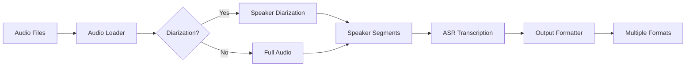

# Audio Transcription Pipeline

A GPU-accelerated audio transcription pipeline using NVIDIA NeMo for automatic speech recognition (ASR) with speaker diarization capabilities.

<div class="grid cards" markdown>

-   :material-rocket-launch-outline:{ .lg .middle } __Quick Start__

    ---

    Get up and running in minutes with our simple installation process

    [:octicons-arrow-right-24: Getting started](getting-started/quickstart.md)

-   :material-gpu:{ .lg .middle } __GPU Accelerated__

    ---

    Leverage NVIDIA GPUs for fast, accurate transcription

    [:octicons-arrow-right-24: Performance guide](deployment/performance.md)

-   :material-account-voice:{ .lg .middle } __Speaker Diarization__

    ---

    Automatically identify and separate different speakers

    [:octicons-arrow-right-24: Diarization guide](guide/diarization.md)

-   :material-docker:{ .lg .middle } __Docker Support__

    ---

    Deploy easily with our pre-configured Docker setup

    [:octicons-arrow-right-24: Docker deployment](deployment/docker.md)

</div>

## Features

- **🚀 High Performance**: GPU-accelerated processing for fast transcription
- **🎯 Accurate ASR**: State-of-the-art NVIDIA NeMo models
- **👥 Speaker Diarization**: Automatic speaker identification and segmentation
- **📝 Multiple Output Formats**: JSON, plain text, and attributed dialogue
- **🔧 Configurable**: Flexible YAML-based configuration
- **🐳 Docker Ready**: Pre-configured containers for easy deployment
- **📊 Batch Processing**: Process entire directories of audio files
- **💾 Smart Caching**: Avoid reprocessing with intelligent caching

## Overview

This pipeline provides a complete solution for transcribing audio files with speaker attribution:



## Quick Example

```bash
# Process a directory of audio files
python main.py --input-dir ./inputs --output-dir ./outputs

# Process with speaker diarization disabled (faster)
python main.py --input-dir ./inputs --disable-diarization

# Use Docker for deployment
docker-compose run --rm audio-transcription
```

## System Requirements

- **GPU**: NVIDIA GPU with 4GB+ VRAM (8GB+ recommended)
- **CUDA**: Version 11.8 or higher
- **Python**: 3.10 or higher
- **RAM**: 16GB minimum
- **Storage**: ~3GB for models plus audio file space

## Next Steps

<div class="grid cards" markdown>

-   :material-download:{ .lg .middle } __[Installation](getting-started/installation.md)__

    ---

    Set up your development environment

-   :material-file-document:{ .lg .middle } __[Configuration](getting-started/configuration.md)__

    ---

    Customize the pipeline for your needs

-   :material-api:{ .lg .middle } __[API Reference](reference/index.md)__

    ---

    Explore the complete API documentation

-   :material-github:{ .lg .middle } __[Contributing](development/contributing.md)__

    ---

    Join us in improving the project

</div>

## License

This project is licensed under the MIT License. See the [LICENSE](https://github.com/yourusername/audio_aigented/blob/main/LICENSE) file for details.