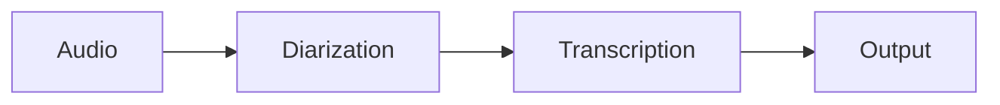

# Audio Transcription Pipeline

GPU-accelerated speech-to-text with speaker identification.

<div class="grid cards" markdown>

-   :material-speedometer:{ .lg .middle } __Quick Reference__

    ---

    Common commands and options at a glance

    [:octicons-arrow-right-24: View reference](quick-reference.md)

-   :material-rocket-launch-outline:{ .lg .middle } __Get Started__

    ---

    Install and run in under 5 minutes

    [:octicons-arrow-right-24: Quick start](getting-started/quickstart.md)

-   :material-help-circle:{ .lg .middle } __FAQ__

    ---

    Solutions to common issues

    [:octicons-arrow-right-24: View FAQ](faq.md)

-   :material-docker:{ .lg .middle } __Docker__

    ---

    Ready-to-use container deployment

    [:octicons-arrow-right-24: Docker guide](deployment/docker.md)

</div>

## Key Features

🚀 **Fast** - GPU acceleration, 10-15x realtime  
🎯 **Accurate** - NVIDIA NeMo state-of-the-art models  
👥 **Speakers** - Automatic speaker identification  
📝 **Flexible** - JSON, text, and dialog formats  
🔧 **Smart** - Context-aware with vocabulary support  

## Quick Example

```bash
# Basic usage
python main.py -i ./inputs

# Fast mode  
python main.py -i ./inputs --disable-diarization

# With context
python main.py -i ./inputs --content-file agenda.html
```

## Requirements

- NVIDIA GPU (4GB+ VRAM)
- CUDA 11.8+
- Python 3.10+
- 16GB RAM

## Pipeline Flow



## License

This project is licensed under the MIT License. See the [LICENSE](https://github.com/yourusername/audio_aigented/blob/main/LICENSE) file for details.